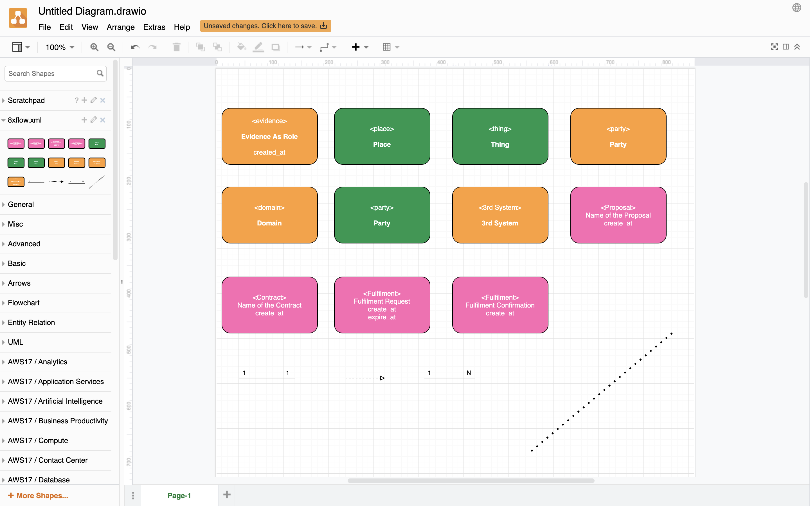
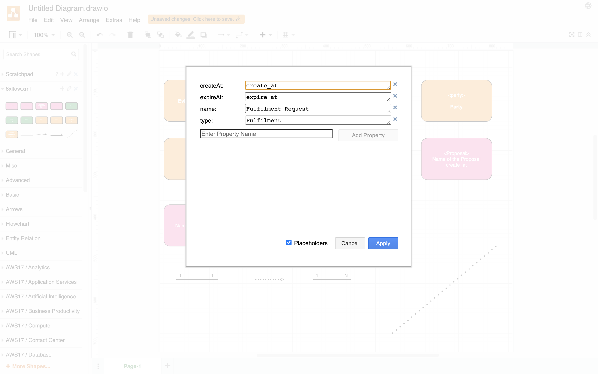

# 8xflow-drawio-lib
Draw.io 8xflow custom library.

## How to Setup?

 - Clone the repo
 - Open draw.io desktop version or open diagram.net in the browser
 - Choose `File -> Open Library` and then choose the `8xflow.xml` from your local disk

You will see the 8xflow library show up in the left panel.

## How to Use it?

The library has predefined notations of 8xflow diagram. You can simply drag and drop from the left panel to the canvas to draw an 8xflow diagram.

To change the value on individual notation, use `Ctrl + M` after selecting a notation. The change to the properties will reflect in the diagram.

